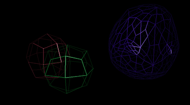

# Computer Graphics II - Catmull-Clark Subdivision




I began by inspecting the outputs of the algorithm for some sample meshes in Blender. This helped me get a feel for the algorithm. Then, I looked online for simple descriptions and explanations. I believed that I had to understand the algorithm well before implementing it, as doing so would probably save a lot of debugging time. For graphics algorithms, making the first implementation as correct as possible is important because they are harder to debug than conventional algorithms.

My platform was Windows 10 and Visual Studio 2022. I began coding by copying a 'library' that I wrote for projects that involve OpenGL. The library saves some time that I would have wasted writing shader uniform passing, buffer binding/unbinding etc. From this point on, I will split the blog into sections for each component of the implementation.

## OBJ Loader

The sample OBJ loader did not support all the features I wanted and was not written in my style. So I decided to replace it. This was trivial and involved learning about the simple OBJ format from some page online, then writing a parser.
At this step I also had to decide on the internal mesh struct/format I would use. Since it was my first implementation of the algorithm, I did not wish to make assumptions about the what would be the most comfortable way to store the mesh data. Therefore I kept it very flexible with just four arrays of structs for vertex, normal, quad and triangle data respectively (the homework only allows tri and quad topologies).

## Catmull-Clark Subdivision

The algorithm has two inputs, a mesh and an integer (level) describing how many times to apply the algorithm. The output is another mesh. I started by defining a function that would do one iteration for quad topologies. I thought I would deal with triangle topologies later. Also, one could write a generic function for all polygons, but since I was only dealing with tris and quads I did not wish to get confused thinking about generalized code. 

### Mesh subdivide_quad(Mesh mesh)

The subdivision implementation is composed of two for loops over the faces:

1. For each face, precompute some stuff we will need later.
2. For each face, access the precomputation results and calculate the new state of each tri/quad.

So what is 'some stuff'? Well, to apply the algorithm to a tri/quad you need to have access to the neighbors of each face, neighbors of each corner, the midpoints of each edge of the face and other similar data. While iterating through the faces, it would be a waste of time to find this information. So I chose to precompute and put it in dictionaries beforehand.

```cpp
std::unordered_map<std::pair<int, int>, std::vector<Quad>, PairHash> nqe; // The quads that touch a given edge
std::unordered_map<int, std::vector<Quad>> nqp; // The faces that touch a given vertex
std::unordered_map<int, std::unordered_set<std::pair<int, int>, PairHash>> nep; // The edges that touch a given vertex 
```

After, I apply the algorithm to each face. This step consists of applying some formulas to generate the positions of 9 points that will form the 4 faces for each original face. I won't go into details as the focus is on the specifics of my implementation and not the algorithm.

### Subdivision pyramid

For the homework I needed to render the same mesh at different levels of subdivision, so I used the described `subdivide` function to fill an array with all needed levels before the rendering stage. Since the output of the algorithm is not exactly suitable for rendering, an additional `load_model` function is used before saving the subdivided model. This function will be described next.

```cpp
void precompute(const Mesh& mesh) {
    Mesh tmp = mesh;
    for (int i = 0; i < MAX_SUBDIVIDE; i++) {
        levels.push_back(load_model(tmp));
        tmp = subdivide(tmp);
    }
}
```

## Processing the subdivided mesh

As mentioned above, I needed to further process the mesh before the GL stage. The function `ModelData load_model(const Mesh& input)` is responsible for three things which it accomplishes in three steps:

### Triangulation & normals

OpenGL cannot render quads directly, so triangulation was needed. Also, the algorithm generates meshes but not normals. The first stage of the `load_model` function looks at the input mesh to see if it is of quad or triangle topology, as the required computation will change based on this. 

For quads, the function will do for each quad:
1. Calculate a normal based on the four corners.
2. Generate six vertices with the computed normal.
3. Generated two triangles from the vertices.

For triangles, the function will do for each triangle:
1. Calculate a normal based on the three corners.
2. Done :)

### GL buffer generation

This step will upload the generated mesh to the GPU and save the indexes & sizes of these buffers to the returned `ModelData` struct instance, which will later be used to tell OpenGL which mesh to render. This step is composed of a bunch of GL API calls.

### Line rendering preparation

I did not mention this before but for the homework it was also required to render the meshes as a wireframe. The simplest way to do this was to just have another index buffer for the line data. The buffer is generated and returned in the struct for later use.

## Main rendering loop

The drawing is very straightforward. The `draw_model` function takes in the object data and the draw mode which signifies if it is wireframe, wireframe with occlusion or solid. The other parameters are self-explanatory. 

```cpp
for (const auto& obj : objects) {
    draw_model(obj->levels[obj->cur_level], shader, obj->draw_data, light_pos, camera_pos, draw_mode);
}
```

The code above is executed in a loop. Before this snippet runs, keyboard events are processed to adjust the rendering based on the user input. User input may change or reset the subdivision level of the rendered meshes, cycle through draw modes or play/pause the animation. The animation is implemented in the simplest way possible, by transforming the model matrix of one of the meshes in a sine wave pattern.

```cpp
glm::translate(tetra_obj.draw_data.transformation, glm::vec3(-1.5 + glm::sin(rot_tetra), -0.5, -8));
```

## Performance

Performance in debug mode for each subdivision level is as follows:

| Level 0 | Level 1 | Level 2 | Level 3 | Level 4 |
|---------|---------|---------|---------|---------|
| 240fps  | 240fps  | 220fps  | 215fps  | 240fps  |

Performance does not seem to be affected much by the subdivision level, as the bottleneck is most likely the draw calls. I believe that we would need the drastically increase the vertex count to observe its effect on performance.

## Moments where I got stuck

1. In Blender, the default settings for the algorithm do an additional optimization that differs from the original paper of the algorithm. I did not notice this at first and thought that my implementation was wrong when Blender was giving different results. Adjusting the settings fixed the issue.
2. Not a specific moment but I wasted a lot of time on off-by-one errors when writing the triangulation code. Saving the broken result to a file and inspecting it in Blender was a life-saver.

## Interesting design choice

Contrary to the homework text, I decided to precalculate all subdivision levels for each mesh before the rendering starts. I believe that this is a better choice as it eliminates the lag when switching between levels in run-time. But, as a tradeoff the startup time is increased.
